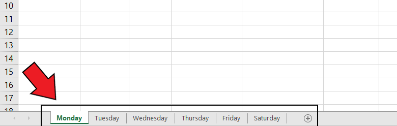
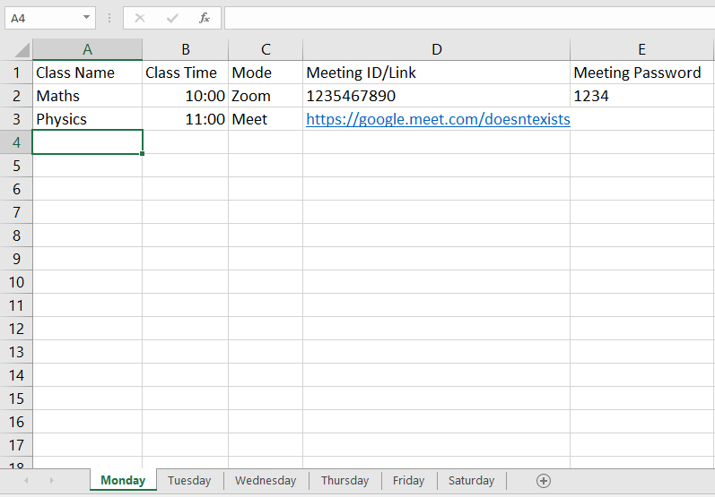

# online-class-bot
Tired of manually joining online classes? The **online-class-bot** is on rescue!!

This **online-class-bot** is a bot written in python which is able to join online classes through zoom and google meet.

## Setup
The repo contains an empty *timetable.xlsx* excel worksheet. You have to fill the correct timetable in the worksheet as follows:

The worksheet contains total six different day-wise sheets.


Next, there are 5 parameters in each sheet.

- Class Name: The name of the class.
- Class Time: The time when the class occurs. Note that the class time **must be in the HH:MM and 24-hour format**. For example, 8 am = 08:00, 10 am = 10:00, and 3 pm = 15:00.
- Mode: The joining mode of the class. It **must be either Zoom or Meet**.
- Meeting ID/Link: The meeting ID for the meeting in case the *Mode* is Zoom. If the *Mode* parameter is Meet, provide the google meet link.
- Meeting Password: The password for the zoom meeting. If the joining mode is Meet, leave this parameter empty.

Fill the timetable for each day (in the different sheets) by following the above instructions.

## Installation
*External Modules Required*:
- pyautogui
- win10toast
- pandas

Just type out the following command:

```pip install -r requirements.txt```

This will download all the dependencies at once.